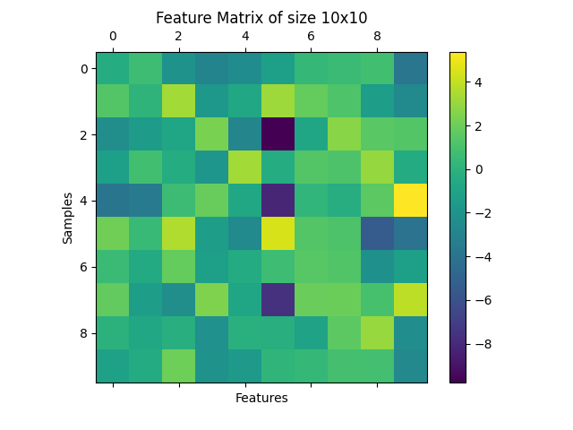
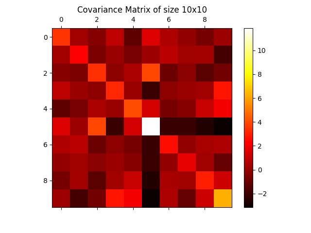
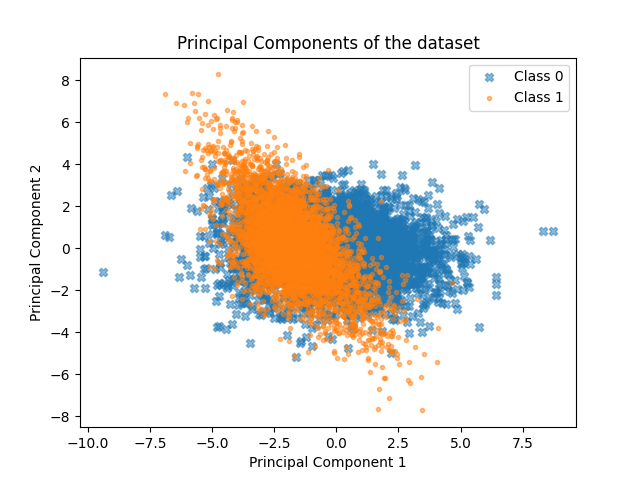

# README

Welcome to the playground-fodder project!

# Description

## PCA

This is a first experiment to implement PCA (Principal Component Analysis) and Covariance Matrix from scratch (mostly) using JAX. PCA is a powerful dimensionality reduction technique commonly used in machine learning and data analysis. The primary objective of PCA is to reduce the number of features in a dataset while preserving as much variance as possible. The PCA uses covariance matrix to find the principal components of the dataset. The principal components are the eigenvectors of the covariance matrix, and they represent the directions of maximum variance in the data. The eigenvectors are sorted in descending order of their corresponding eigenvalues, which represent the amount of variance explained by each principal component. The principal components can be used to project the data onto a lower-dimensional subspace, which can help reduce the dimensionality of the dataset while preserving most of the variance.

# Examples

## Dataset
```python
import jax.numpy as jnp
from sklearn.datasets import make_classification
import matplotlib.pyplot as plt
import covarianceMatrix as cm

seed_num = 490
X, y = make_classification(n_samples = 10000, n_features=10, n_informative = 8, scale=1, random_state=seed_num)
X = jnp.array(X)
y = jnp.array(y)

# Create a figure and a single set of axes
fig, ax = plt.subplots(1, 1)
# Use ax.matshow to plot the matrix on the given axes
cax = ax.matshow(X[:10, :])
# Set the labels and title
ax.set_xlabel("Features")
ax.set_ylabel("Samples")
ax.set_title("Feature Matrix of size 10x10")
# Add a colorbar to the plot for reference
fig.colorbar(cax)
```
[]

## Example Covariance Matrix

```python  
# Compute the covariance matrix of the dataset X
x_cov = cm.get_covariance_matrix(X)  # Example covariance matrix of size 10x10
# Create a figure and a single set of axes
fig, ax = plt.subplots(1, 1)
# Plot the covariance matrix on the specified axes
cov_matrix = ax.matshow(x_cov, cmap='hot')
# Set the title of the plot
ax.set_title("Covariance Matrix of size 10x10")
# Add a colorbar to the plot for reference
fig.colorbar(cov_matrix)
# Display the plot
plt.show()
```



## Example PCA

```python
pc1, pc2 = cm.get_principal_componentes(X)

plt.scatter(pc1[y==0], pc2[y==0], marker='X', alpha=0.5, label="Class 0")
plt.scatter(pc1[y==1], pc2[y==1], marker='.', alpha=0.5, label="Class 1")

plt.xlabel("Principal Component 1")
plt.ylabel("Principal Component 2")
plt.title("Principal Components of the dataset")

plt.legend(["Class 0", "Class 1"])
```


## Contributing

Contributions are welcome! If you have any ideas, bug fixes, or improvements, please submit a pull request. Make sure to follow the coding guidelines and include relevant tests.

## License

This project is licensed under the MIT License. See the [LICENSE](LICENSE) file for more details.
